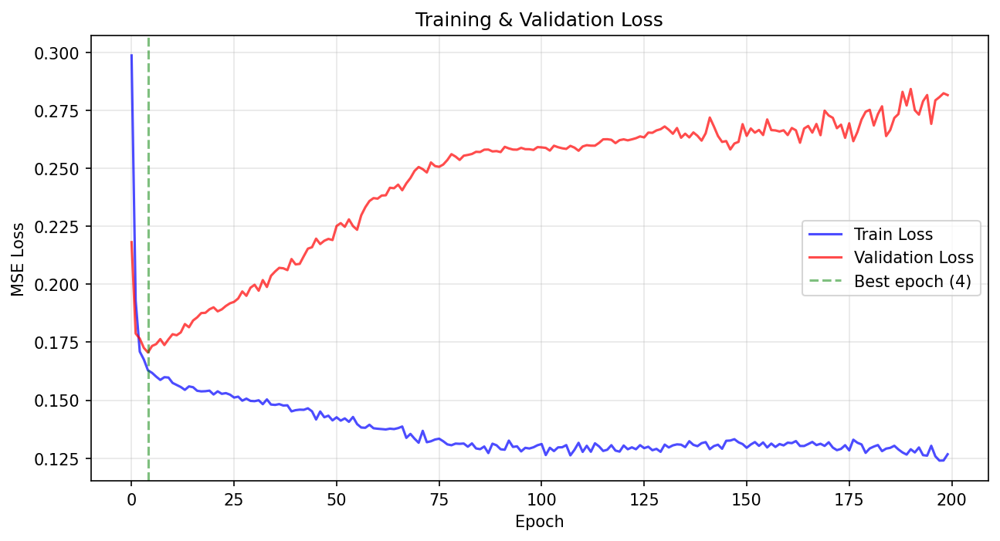
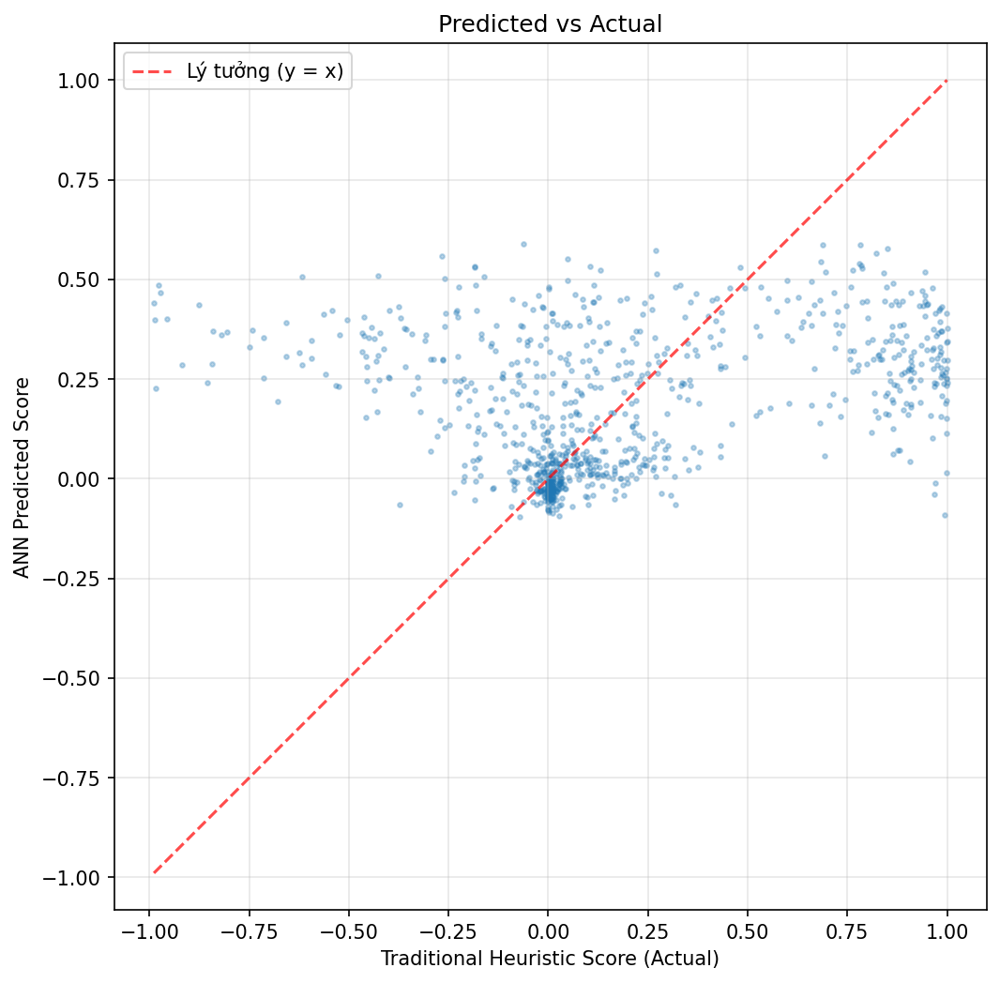
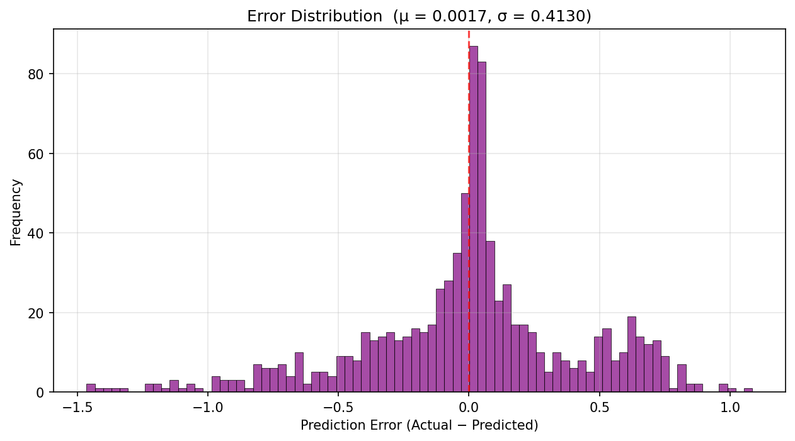

# ANN Heuristic Predictor — Training Report

## Summary

| Metric | Value |
|--------|-------|
| Samples (train / val) | 4957 / 875 |
| Epochs | 200 |
| Best val_loss | 0.170575 |
| R² Score | 0.0286 |
| Pearson Correlation | 0.2437 |
| p-value | 2.69e-13 |
| MSE | 0.170575 |
| MAE | 0.292669 |
| Error Mean (μ) | 0.0017 |
| Error Std (σ) | 0.4130 |

## Charts

### 1. Loss Curve

Training and validation MSE loss over 200 epochs. Green dashed line marks the epoch with lowest validation loss (epoch 4).

### 2. Predicted vs Actual

Scatter plot of ANN predictions vs traditional heuristic values on the validation set. The red dashed line indicates ideal perfect prediction (y = x).

### 3. Error Distribution

Histogram of prediction errors (actual − predicted). A distribution centered near zero indicates unbiased predictions.

## Interpretation

- **R² = 0.0286**: The ANN explains 2.9% of the variance in the traditional heuristic scores. This is a weak correlation.
- **Pearson r = 0.2437**: Trung bình linear relationship between ANN and traditional heuristic.
- **Error distribution**: The prediction error tập trung gần 0 (μ = 0.0017), suggesting the ANN 'does not exhibit significant systematic bias'.
